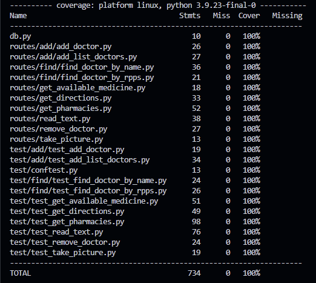

# Tests Routes explanation

## How to write a test

Tests help validate that each route works as expected. To add a test to the application, follow these steps:

### Step 1: Create a test file

In the `test/` directory, create a test file for the corresponding route. If you're testing the `update_doctor` route, name the file `test_update_doctor.py`.

### Step 2: Import necessary modules

Make sure to import `pytest`:

```python
import pytest
```

### Step 3: Write a test for the route

Use the appropriate method (`client.get()`, `client.post()`, etc.) to test the route. For example, to test updating a doctor:

```python
def test_update_doctor_success(client):
    response = client.put('/update_doctor', json={
        'first_name': 'John',
        'last_name': 'Doe',
        'rpps': '1234567890',
        'sector': 'General',
        'region': 'Ile-de-France'
    })
    assert response.status_code == 200
    assert b'Doctor updated successfully' in response.data
```

### Step 4: Add tests for error cases

Also, test scenarios where the data is incorrect or fields are missing:

```python
def test_update_doctor_missing_field(client):
    response = client.put('/update_doctor', json={
        'first_name': 'John',
        'last_name': 'Doe',
        'sector': 'General'
    })
    assert response.status_code == 400
    assert b'Missing rpps field' in response.data
```

### Step 5: Order of execution

#### Step 5.1: Add the order of execution

Just before the `def` add an order it will be useful for some line of execution.

Please add a comments to say witch LOX (lien of execution) it refers to.

```python
@pytest.mark.order(2) # LOX n°66
def test_update_doctor_missing_field(client):
```

#### Step 5.2: Update execution line files and directory

In the `LineOfExecution`folder, update the .txt files or add a new one.

### Step 6: Run the tests

#### Step 6.1 : Start the app, start the db and put the dump in the db

Don't forget to start the app; follow [this readme](../README.md)

#### Step 6.2 : Start the tests

To run the tests with Docker, use the following command:

```bash
docker-compose run --rm test
```

## How to launch the tests

To get all information about the dependencies, the launching and more please refers to [this documentation](../README.md)

## Results

Thanks to our tests we have 100% coverage:


