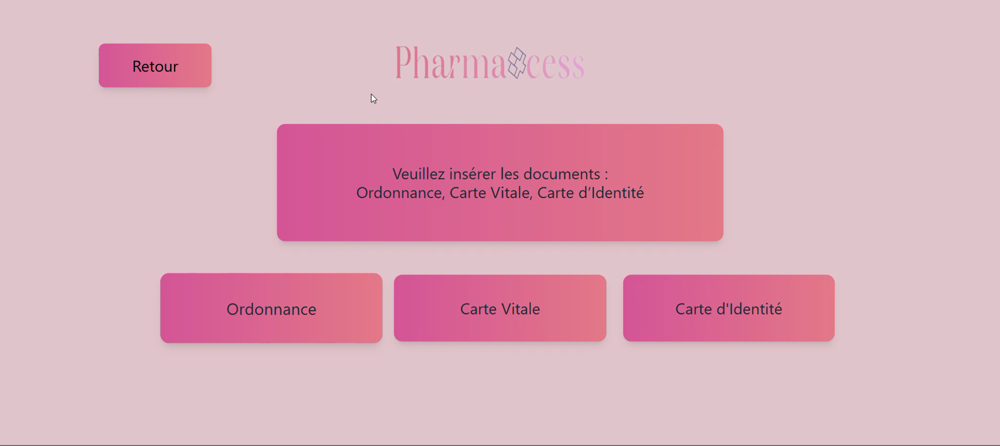
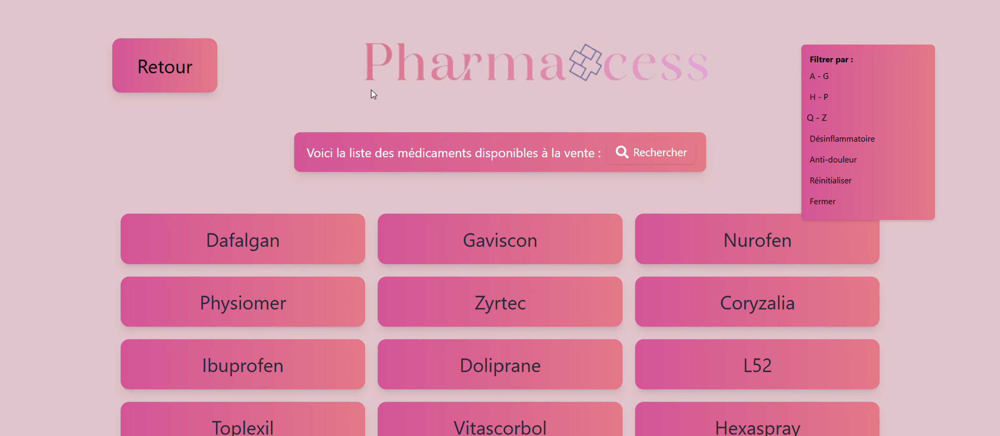
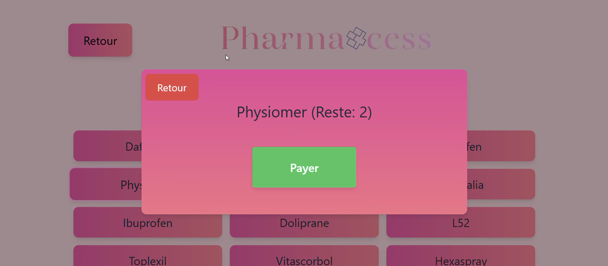
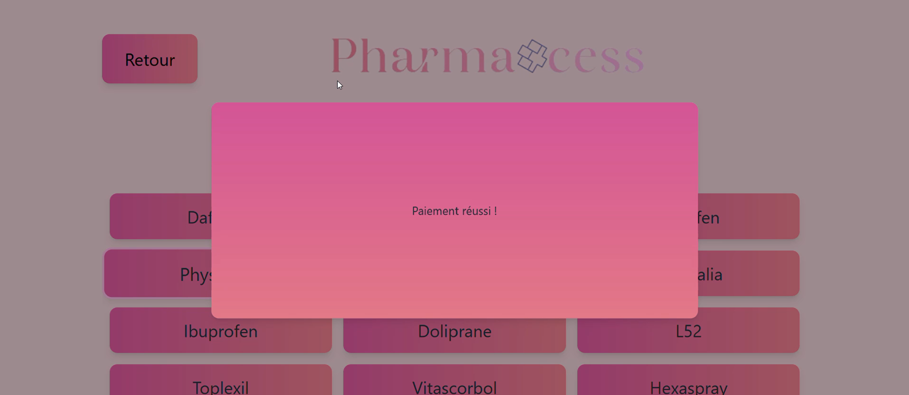
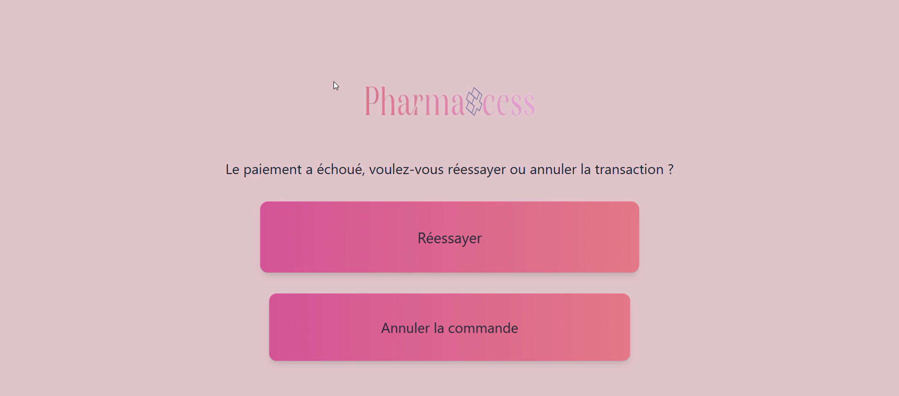

# Guide Utilisateur

## Sommaire

- [Page 1 – Accueil](#page-1--accueil)
- [Page 2 – Médicaments avec ordonnance](#page-2--médicaments-avec-ordonnance)
- [Page 3 – Médicaments sans ordonnance](#page-3--médicaments-sans-ordonnance)
- [Page 4 – Paiement échoué](#page-4--paiement-échoué)

## Page 1 – Accueil

La première page de l’application présente deux boutons :

- `Médicaments avec ordonnance`
- `Médicaments sans ordonnance`

L’utilisateur clique sur l’option correspondant à sa situation.

[Retour au sommaire](#sommaire)

## Page 2 – Médicaments avec ordonnance

Une fois l’option "avec ordonnance" choisie, l’utilisateur est invité à :

- Scanner **l’ordonnance**
- Scanner **la carte vitale**
- Scanner **la carte d’identité**

Chaque action ouvre une **pop-up** demandant dans un premier temps de prendre la photo.

Puis une fois la photo prise la confirmation ou un nouveau scan après prévisualisation de l’image.

[Retour au sommaire](#sommaire)

## Page 3 – Médicaments sans ordonnance

Après avoir cliqué sur "sans ordonnance", une **liste de médicaments** s'affiche.

Fonctionnalités disponibles :

- **Défilement de la liste**
- **Filtres** :
  - Médicaments de A à G
  - Médicaments de H à P
  - Médicaments de Q à Z
  - Anti-inflammatoires uniquement
  - Anti-douleurs uniquement

En cliquant sur un médicament :

- Affichage du **stock disponible**
- Bouton pour **payer**

Si le stock est suffisant, un message confirme que le **paiement a réussi**.

[Retour au sommaire](#sommaire)

## Page 4 – Paiement échoué

Si aucun stock n’est disponible, un message apparaît :
> "Le paiement a échoué. Voulez-vous réessayer ou annuler la transaction ?"

Deux boutons sont proposés :

- `Réessayer` → Retour à la page précédente
- `Annuler la commande` → Retour à la page d’accueil

[Retour au sommaire](#sommaire)

[Retour au readme distributeur](../Readme.md)
