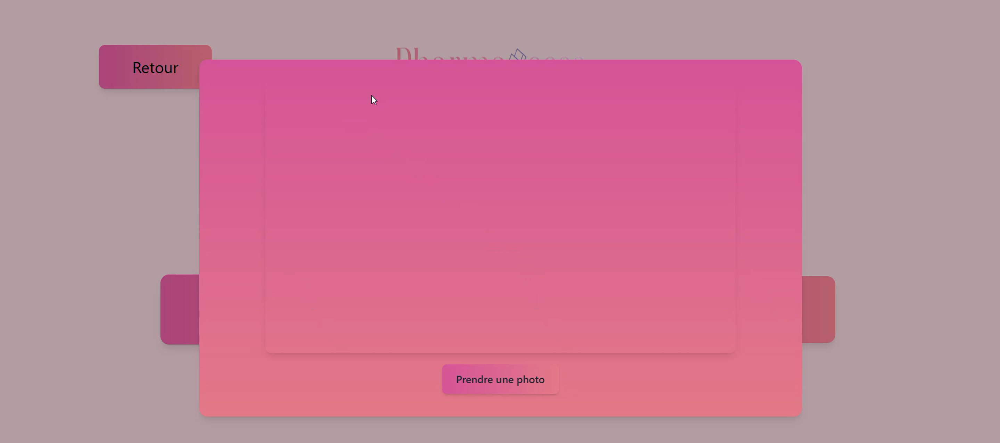
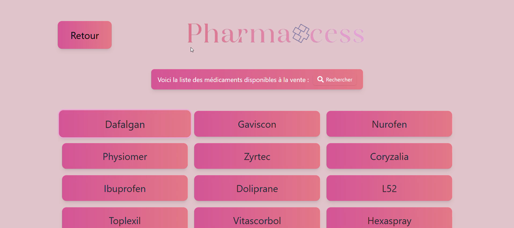
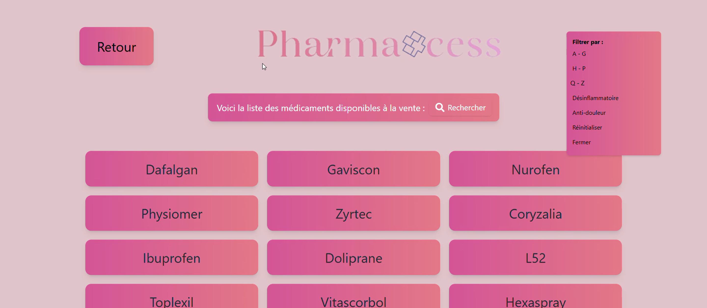
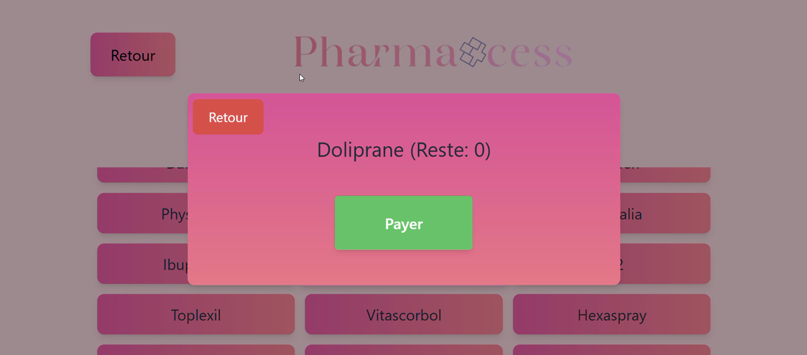
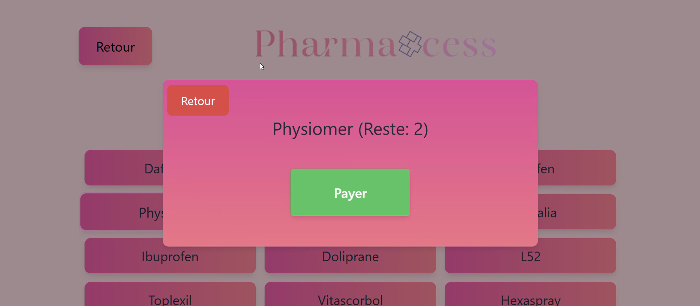
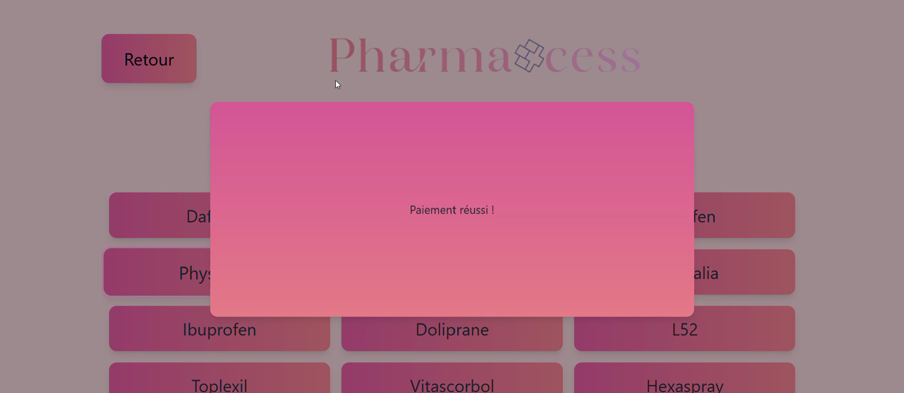
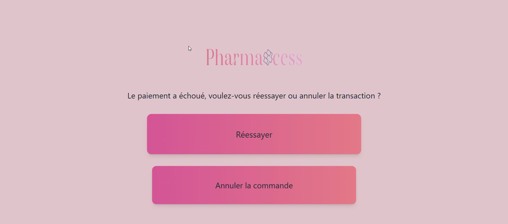

# User Guide

## Table of Contents

- [Page 1 – Home](#page-1--home)
- [Page 2 – Medications with Prescription](#page-2--medications-with-prescription)
- [Page 3 – Medications without Prescription](#page-3--medications-without-prescription)
- [Page 4 – Failed Payment](#page-4--failed-payment)

## Page 1 – Home

The home page displays two buttons:

- `Medications with prescription`
- `Medications without prescription`

The user selects based on their needs.

[Back to table of contents](#table-of-contents)

## Page 2 – Medications with Prescription

After choosing "with prescription", the user is prompted to:

- Scan their **prescription**
- Scan their **health card**
- Scan their **ID card**

Each action opens a **pop-up** asking firstly to take the picture.

Then to confirm the image or retake it after preview.

[Back to table of contents](#table-of-contents)

## Page 3 – Medications without Prescription

Upon selecting "without prescription", a **list of medications** appears.

Available features:

- **Scroll through the list**
- **Apply filters**:
  - Medications from A to G
  - Medications from H to P
  - Medications from Q to Z
  - Anti-inflammatory only
  - Painkillers only

Clicking on a medication shows:

- **Stock availability**
- **Pay button**

If stock is available, a message confirms the **payment was successful**.

[Back to table of contents](#table-of-contents)

## Page 4 – Failed Payment

If no stock is available, the user sees this message:
> "Payment failed. Would you like to try again or cancel the transaction?"

Two buttons are shown:

- `Try again` → Returns to the previous page
- `Cancel order` → Returns to the home page

[Back to table of contents](#table-of-contents)

[Back to distributeur readme](../Readme.md)
