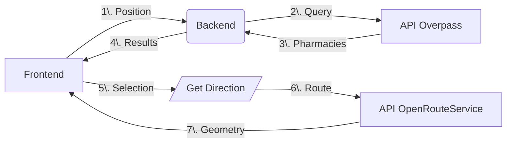

# Complete Documentation: Pharmacy Search and Route Calculation

## I. Backend - Route /get_pharmacies

Objective:
Find pharmacies near a geographic location.

### I.1. Operation

1. Parameters

    - lat (required): Latitude of the search point
    - lon (required): Longitude of the search point
    - radius (optional): Search radius in meters (default: 1000m)

2. Process

    ```py
    # 1. Validate coordinates
    if not lat or not lon: return 400

    # 2. Query the Overpass API (OpenStreetMap)
    query = f"""
    [out:json];
    node["amenity"="pharmacy"](around:{radius},{lat},{lon});
    out body;
    """

    # 3. Process results
    pharmacies = [
        {
            "name": node["tags"].get("name", "Unknown"),
            "latitude": node["lat"],
            "longitude": node["lon"]
        } for node in response.json()["elements"]
    ]

    # 4. Sort by distance (Haversine formula)
    sorted_pharmacies = sorted(pharmacies, key=lambda ph: haversine(lat, lon, ph["lat"], ph["lon"]))

    # 5. Dynamic radius adaptation
    while len(pharmacies) < 10 and radius < 1_000_000:
        radius *= 2  # Double the radius if < 10 results
    ```

3. Responses

    - 200 OK: List of pharmacies (max 10)
    - 400 Bad Request: Missing coordinates
    - 404 Not Found: No pharmacies found
    - 500 Internal Error: Overpass API error

### I.2. Tips

- Use a timeout (e.g., 10s) to avoid blocking
- Filter pharmacies without a name ("Unknown")
- The Haversine formula is optimized for short distances

## II. Frontend - InsufficientStock Component

### II.1. Workflow

1. Get user position via navigator.geolocation
2. Call /get_pharmacies with coordinates
3. Display results in an interactive modal

### II.2. Key Features

```js
// Pharmacy cache
const cacheKey = `${lat},${lon}`;
if (pharmaciesCache[cacheKey]) {
    setPharmaciesList(pharmaciesCache[cacheKey]);
}

// Keyboard navigation
useEffect(() => {
    const handleKeyDown = (e) => {
        if (e.key === "ArrowRight") setSelectedIndex(prev => prev + 1);
        if (e.key === "ArrowLeft") setSelectedIndex(prev => prev - 1);
        if (e.key === "Enter") handleSelect(pharmaciesList[selectedIndex]);
    };
    document.addEventListener("keydown", handleKeyDown);
}, []);
```

### II.3. Distance Calculation

```js
const R = 6371; // Earth radius in km
const dLat = (pharmacy.lat - userLat) * (Math.PI/180);
const dLon = (pharmacy.lon - userLon) * (Math.PI/180);
const distance = R * Math.sqrt(dLat**2 + dLon**2);
```

## III. Backend - Route /get_direction

### III.1. Objective

Calculate a route between two points via OpenRouteService.

### III.2. Operation

```py
# Transport mode configuration
ORS_PROFILES = {
    'foot': 'foot-walking',
    'car': 'driving-car',
    'bicycle': 'cycling-regular'
}

@get_directions_bp.route('/get_direction', methods=['GET'])
def get_directions():
    # 1. Validate parameters
    origin = request.args.get('origin')  # Format: "lat,lon"
    destination = request.args.get('destination')

    # 2. Call OpenRouteService
    headers = {'Authorization': API_KEY}
    body = {
        "coordinates": [
            [origin_lon, origin_lat],
            [dest_lon, dest_lat]
        ]
    }
    response = requests.post(
        f"https://api.openrouteservice.org/v2/directions/{ORS_PROFILES[mode]}",
        headers=headers,
        json=body
    )

    # 3. Return encoded geometry
    return jsonify(response.json())
```

### III.3. Common Errors

- 400: Invalid coordinates
- 500: Missing API key or ORS error

## IV. Frontend - DirectionsMapPage Component

### IV.1. Workflow

1. Get URL parameters

    ```js
    const { lat, lon, name, transport } = useParams();
    ```

2. Call /get_direction with coordinates
3. Display the route on a Leaflet map

### IV.2. Path Decoding

```js
import polyline from '@mapbox/polyline';

// Convert polyline to coordinates
const routeCoords = polyline.decode(apiResponse.geometry).map(
    ([lat, lon]) => [lat, lon]
);
```

### IV.3. Map Management

```js
<MapContainer center={center} zoom={13}>
    <TileLayer url="https://{s}.tile.openstreetmap.org/{z}/{x}/{y}.png"/>
    <Marker position={userPosition} />
    <Marker position={[pharmacy.lat, pharmacy.lon]} />
    <Polyline positions={routeCoords} color="blue" />
</MapContainer>
```

## V. Code Snippet Examples

### V.1. Backend - Haversine

```py
def haversine(lat1, lon1, lat2, lon2):
    R = 6371  # Earth radius in km
    dlat = radians(lat2 - lat1)
    dlon = radians(lon2 - lon1)
    a = sin(dlat/2)**2 + cos(lat1)*cos(lat2)*sin(dlon/2)**2
    return R * 2 * atan2(sqrt(a), sqrt(1-a))
```

### V.2. Frontend - Cache

```js
// Save to localStorage
const setPharmaciesCache = (data) => {
    localStorage.setItem('pharmaciesCache',
        JSON.stringify({ data, timestamp: Date.now() })
};

// Usage with expiration (1h)
if (Date.now() - cachedData.timestamp < 3600000) {
    return cachedData.data;
}
```

## VI. Essential Tips

### VI.1. Security

- Validate ALL user inputs
- Store API keys in environment variables
- Use HTTPS in production

### VI.2. Performance

- Limit results to 10 pharmacies
- Client-side caching (localStorage)
- Request timeouts (e.g., 5s)

### VI.3. Mobile UX

- Responsive design
- Large clickable areas
- Visual feedback during loading

### VI.4. Keyboard Ergonomics

```js
// Focus management
useEffect(() => {
    if (modalOpen) closeButtonRef.current.focus();
}, [modalOpen]);
```

## VII. Global Explanations

### VII.1. Architecture



### VII.2. Best Practices

- Decoupling: Independent Frontend/Backend
- Stateless: No server-side sessions
- Modular: Reusable components
- Documentation: Swagger for APIs

### VII.3. Alternatives

- Replace Overpass with Google Places API
- Use Mapbox instead of OpenRouteService
- Implement a Redis cache server-side

### VII.4. Points of Attention

- Overpass limitations (request frequency)
- Cost of premium APIs (OpenRouteService)
- Geolocation permissions (browser)
