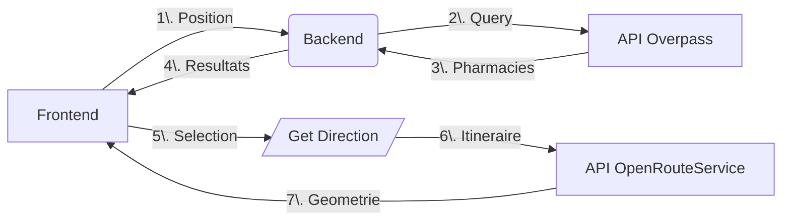

# Documentation Complète : Recherche de Pharmacies et Calcul d'Itinéraires

## I. Backend - Route /get_pharmacies

Objectif :
Trouver les pharmacies à proximité d'une position géographique.

### I.1. Fonctionnement

1. Paramètres

    - lat (obligatoire) : Latitude du point de recherche
    - lon (obligatoire) : Longitude du point de recherche
    - radius (optionnel) : Rayon de recherche en mètres (défaut : 1000m)

2. Processus

    ```py
    # 1. Validation des coordonnées
    if not lat or not lon: return 400

    # 2. Requête à l'API Overpass (OpenStreetMap)
    query = f"""
    [out:json];
    node["amenity"="pharmacy"](around:{radius},{lat},{lon});
    out body;
    """

    # 3. Traitement des résultats
    pharmacies = [
        {
            "name": node["tags"].get("name", "Unknown"),
            "latitude": node["lat"],
            "longitude": node["lon"]
        } for node in response.json()["elements"]
    ]

    # 4. Tri par distance (formule Haversine)
    sorted_pharmacies = sorted(pharmacies, key=lambda ph: haversine(lat, lon, ph["lat"], ph["lon"]))

    # 5. Adaptation dynamique du rayon
    while len(pharmacies) < 10 and radius < 1_000_000:
        radius *= 2  # Double le rayon si < 10 résultats
    ```

3. Réponses

    - 200 OK : Liste des pharmacies (max 10)
    - 400 Bad Request : Coordonnées manquantes
    - 404 Not Found : Aucune pharmacie trouvée
    - 500 Internal Error : Erreur API Overpass

### I.2. Tips

- Utiliser un timeout (ex: 10s) pour éviter des blocages
- Filtrer les pharmacies sans nom ("Unknown")
- La formule Haversine est optimisée pour les distances courtes

## II. Frontend - Composant InsufficientStock

### II.1. Workflow

1. Récupère la position utilisateur via navigator.geolocation
2. Appelle /get_pharmacies avec les coordonnées
3. Affiche les résultats dans une modale interactive

### II.2. Fonctionnalités clés

```js
// Cache des pharmacies
const cacheKey = `${lat},${lon}`;
if (pharmaciesCache[cacheKey]) {
    setPharmaciesList(pharmaciesCache[cacheKey]);
}

// Navigation clavier
useEffect(() => {
    const handleKeyDown = (e) => {
        if (e.key === "ArrowRight") setSelectedIndex(prev => prev + 1);
        if (e.key === "ArrowLeft") setSelectedIndex(prev => prev - 1);
        if (e.key === "Enter") handleSelect(pharmaciesList[selectedIndex]);
    };
    document.addEventListener("keydown", handleKeyDown);
}, []);
```

### II.3. Calcul de distance

```js
const R = 6371; // Rayon terrestre en km
const dLat = (pharmacy.lat - userLat) * (Math.PI/180);
const dLon = (pharmacy.lon - userLon) * (Math.PI/180);
const distance = R * Math.sqrt(dLat**2 + dLon**2);
```

## III. Backend - Route /get_direction

### III.1. Objectif

Calculer un itinéraire entre deux points via OpenRouteService.

### III.2. Fonctionnement

```py
# Configuration des modes de transport
ORS_PROFILES = {
    'foot': 'foot-walking',
    'car': 'driving-car',
    'bicycle': 'cycling-regular'
}

@get_directions_bp.route('/get_direction', methods=['GET'])
def get_directions():
    # 1. Validation des paramètres
    origin = request.args.get('origin')  # Format: "lat,lon"
    destination = request.args.get('destination')

    # 2. Appel à OpenRouteService
    headers = {'Authorization': API_KEY}
    body = {
        "coordinates": [
            [origin_lon, origin_lat],
            [dest_lon, dest_lat]
        ]
    }
    response = requests.post(
        f"https://api.openrouteservice.org/v2/directions/{ORS_PROFILES[mode]}",
        headers=headers,
        json=body
    )

    # 3. Renvoi de la géométrie encodée
    return jsonify(response.json())
```

### III.3. Erreurs courantes

- 400 : Coordonnées invalides
- 500 : Clé API manquante ou erreur ORS

## IV. Frontend - Composant DirectionsMapPage

### IV.1. Workflow

1. Récupère les paramètres d'URL

    ```js
    const { lat, lon, name, transport } = useParams();
    ```

2. Appelle /get_direction avec les coordonnées
3. Affiche l'itinéraire sur une carte Leaflet

### IV.2. Décodage du tracé

```js
import polyline from '@mapbox/polyline';

// Conversion de la polyline en coordonnées
const routeCoords = polyline.decode(apiResponse.geometry).map(
    ([lat, lon]) => [lat, lon]
);
```

### IV.3. Gestion carte

```js
<MapContainer center={center} zoom={13}>
    <TileLayer url="https://{s}.tile.openstreetmap.org/{z}/{x}/{y}.png"/>
    <Marker position={userPosition} />
    <Marker position={[pharmacy.lat, pharmacy.lon]} />
    <Polyline positions={routeCoords} color="blue" />
</MapContainer>
```

## V. Extrait de Code d'Exemple

### V.1. Backend - Haversine

```py
def haversine(lat1, lon1, lat2, lon2):
    R = 6371  # Earth radius in km
    dlat = radians(lat2 - lat1)
    dlon = radians(lon2 - lon1)
    a = sin(dlat/2)**2 + cos(lat1)*cos(lat2)*sin(dlon/2)**2
    return R * 2 * atan2(sqrt(a), sqrt(1-a))
```

### V.2. Frontend - Cache

```js
// Sauvegarde dans localStorage
const setPharmaciesCache = (data) => {
    localStorage.setItem('pharmaciesCache',
        JSON.stringify({ data, timestamp: Date.now() })
};

// Usage avec expiration (1h)
if (Date.now() - cachedData.timestamp < 3600000) {
    return cachedData.data;
}
```

## VI. Tips Essentiels

### VI.1. Sécurité

- Valider TOUTES les entrées utilisateur
- Stocker les clés API dans des variables d'environnement
- Utiliser HTTPS en production

### VI.2. Performance

- Limiter les résultats à 10 pharmacies
- Mise en cache côté client (localStorage)
- Timeout des requêtes (ex: 5s)

### VI.3. UX Mobile

- Design responsive
- Zones cliquables larges
- Feedback visuel pendant le chargement

### VI.4. Ergonomie clavier

```js
// Focus management
useEffect(() => {
    if (modalOpen) closeButtonRef.current.focus();
}, [modalOpen]);
```

## VII. Explications Globales

### VII.1. Architecture



### VII.2. Bonnes Pratiques

- Découplage : Front/Back indépendants
- Stateless : Pas de sessions côté serveur
- Modulaire : Composants réutilisables
- Documentation : Swagger pour les API

### VII.3. Alternatives

- Remplacer Overpass par Google Places API
- Utiliser Mapbox au lieu d'OpenRouteService
- Implémenter un cache Redis côté serveur

### VII.4. Points d'attention

- Limitations d'Overpass (fréquence requêtes)
- Coût des APIs premium (OpenRouteService)
- Permissions de géolocalisation (navigateur)
