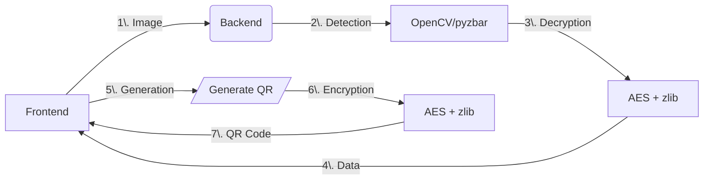

# Complete Documentation: QR Code Generation and Reading

## I. Backend - Route /generate_prescription_qr

Objective:
Generates an encrypted QR code containing medical prescription information.

### I.1. Operation

1. Parameters

    - doctor (required): Object containing doctor information
    - patient (required): Object containing patient information
    - date (required): Prescription date (String)
    - content (required): Prescription content (Array)

2. Process

    ```py
    # 1. Validate required fields
    required_fields = ['doctor', 'patient', 'date', 'content']
    for field in required_fields:
        if field not in data:
            return jsonify({"error": f"Le champ '{field}' est requis"}), 400

    # 2. Generate QR code with encryption
    img_buffer = generate_rounded_qr_code(data, "prescription", True)

    # 3. Return image file
    return send_file(img_buffer, mimetype='image/png', 
                    as_attachment=True, download_name='prescription_qr.png')
    ```

3. Responses

    - 200 OK: Generated QR code image file
    - 400 Bad Request: Missing required fields
    - 500 Internal Error: Generation error

### I.2. Security

- AES-ECB encryption of data
- zlib compression to reduce size
- Encryption key stored in .env
- QR code with rounded modules and custom color

## II. Backend - Route /generate_direction_qr

### II.1. Objective

Generates a QR code containing pharmacy direction information.

### II.2. Operation

```py
# Required parameters
required_fields = ['pharmacy', 'transport', 'userCoords']

# Optional data
- routeCoords: Route coordinates (Array, Optional)

# QR code generation
img_buffer = generate_rounded_qr_code(data, "direction", True)
```

### II.3. Data Structure

```json
{
    "pharmacy": {
        "name": "Pharmacy Name",
        "latitude": 48.8566,
        "longitude": 2.3522
    },
    "transport": "foot|car|bicycle",
    "userCoords": [48.8566, 2.3522],
    "routeCoords": [[48.8566, 2.3522], [48.8576, 2.3532]]
}
```

## III. Backend - Route /read_prescription_qr

### III.1. Objective

Reads and decrypts a QR Code containing prescription information.

### III.2. Operation

```py
# 1. Validate image file
if 'image' not in request.files:
    return jsonify({"success": False, "error": "Aucun fichier image fourni"}), 400

# 2. Temporary save
with tempfile.NamedTemporaryFile(delete=False, suffix='.jpg') as temp_file:
    file.save(temp_file.name)
    temp_path = temp_file.name

# 3. Read and decrypt
success, result = read_qr_code(temp_path)

# 4. Cleanup and return
os.unlink(temp_path)
```

### III.3. Robust Detection

- Multi-scale detection (0.5x to 3.0x)
- Aggressive image enhancement (CLAHE, adaptive thresholding, etc.)
- Automatic perspective correction
- Image rotation (0°, 90°, 180°, 270°)
- Support for tilted or deformed QR codes

## IV. Frontend - StepOrdonnance Component

### IV.1. Workflow

1. Select scan type (QR or classic prescription)
2. Open camera via ModalCamera
3. Capture and process image
4. API call based on scan type

### IV.2. QR Code Handling

```js
// QR code verification
const checkQRCode = async (blob) => {
    const formData = new FormData();
    formData.append("image", blob, "photo.jpg");

    const response = await fetch(`${config.backendUrl}/read_prescription_qr`, {
        method: "POST",
        body: formData,
    });

    return await response.json();
};

// QR data processing
if (qrData.success) {
    const medicaments = qrData.prescription?.content?.map((med, index) => ({
        id: index + 1,
        nom: med.split(' - ')[0] || `Médicament ${index + 1}`,
        posologie: med.split(' - ')[1] || med
    })) || [];

    updatePrescriptionData({
        medicaments: medicaments,
        scanType: 'qr',
        hasQRCode: true,
        rawData: qrData.prescription
    });
}
```

### IV.3. Keyboard Navigation

```js
// Key handling
useEffect(() => {
    const handleKeyDown = (e) => {
        if (e.key === "ArrowRight") setSelectedIndex(prev => prev + 1);
        if (e.key === "ArrowLeft") setSelectedIndex(prev => prev - 1);
        if (e.key === "Enter") handleSelect(pharmaciesList[selectedIndex]);
    };
    document.addEventListener("keydown", handleKeyDown);
}, []);
```

## V. Frontend - MapQrCodePage Component

### V.1. Direction QR Generation

```js
const generateQRCode = async () => {
    try {
        const response = await fetch(`${config.backendUrl}/generate_direction_qr`, {
            method: 'POST',
            headers: { 'Content-Type': 'application/json' },
            body: JSON.stringify(qrData),
        });

        if (response.ok) {
            const blob = await response.blob();
            const url = URL.createObjectURL(blob);
            setQrCodeUrl(url);
        }
    } catch (err) {
        setError('Network error: ' + err.message);
    }
};
```

### V.2. QR Code Display

```js
{qrCodeUrl && (
    <div className="flex flex-col items-center space-y-4">
        
        <p className="text-sm text-gray-600 text-center">
            Scan this QR code to get directions
        </p>
    </div>
)}
```

## VI. QR Code Scripts

### VI.1. Generation (qrCodeGen.py)

```py
def generate_rounded_qr_code(info, base_filename="prescription", return_buffer=False):
    # 1. Convert to JSON
    json_content = json.dumps(info, ensure_ascii=False, separators=(',', ':'))

    # 2. zlib compression
    compressed_data = zlib.compress(json_content.encode('utf-8'))

    # 3. AES encryption
    encrypted_content = encrypt_data(compressed_data, secret_key)

    # 4. Generate styled QR code
    qr = qrcode.QRCode(
        version=None,
        error_correction=qrcode.constants.ERROR_CORRECT_Q,
        box_size=10,
        border=2,
    )
    
    # 5. Create image with rounded modules
    img = qr.make_image(
        image_factory=StyledPilImage,
        module_drawer=RoundedModuleDrawer(),
        color_mask=SolidFillColorMask(
            front_color=get_qr_color(),
            back_color=(255, 255, 255)
        ),
    )
```

### VI.2. Reading (qrCodeLect.py)

```py
def detect_qr_codes_aggressively(image):
    # Multi-scale detection
    scales = [0.5, 0.75, 1.0, 1.25, 1.5, 1.75, 2.0, 2.5, 3.0]
    
    for scale in scales:
        # Resize
        resized = cv2.resize(image, None, fx=scale, fy=scale)
        
        # Image enhancement
        enhanced_images = super_enhance_image(resized)
        
        # Detection with OpenCV and pyzbar
        for enhanced_img in enhanced_images:
            # OpenCV detection
            detector = cv2.QRCodeDetector()
            data_single, points, _ = detector.detectAndDecode(enhanced_img)
            
            # pyzbar detection
            qr_codes = decode(enhanced_img, symbols=[ZBarSymbol.QRCODE])
```

## VII. Code Snippet Examples

### VII.1. Backend - Encryption

```py
def encrypt_data(data, key):
    cipher = AES.new(key, AES.MODE_ECB)
    if isinstance(data, str):
        data = data.encode('utf-8')
    padded_data = pad(data, AES.block_size)
    encrypted_data = cipher.encrypt(padded_data)
    return base64.b64encode(encrypted_data).decode('utf-8')
```

### VII.2. Frontend - State Management

```js
// Prescription context
const updatePrescriptionData = (data) => {
    setPrescriptionData(prev => ({
        ...prev,
        ...data,
        timestamp: Date.now()
    }));
};

// localStorage cache
const setPrescriptionCache = (data) => {
    localStorage.setItem('prescriptionCache',
        JSON.stringify({ data, timestamp: Date.now() })
    );
};
```

## VIII. Essential Tips

### VIII.1. Security

- 32-byte minimum encryption key
- Secure key storage in .env
- Strict input data validation
- Automatic temporary file cleanup

### VIII.2. Performance

- zlib compression to reduce QR code size
- Multi-scale detection for improved recognition
- Client-side cache for frequent data
- Request timeouts (e.g., 10s)

### VIII.3. Mobile UX

- Touch-optimized interface
- Visual feedback during processing
- User-friendly error handling
- Support for deformed or tilted QR codes

### VIII.4. Robustness

```js
// Complete error handling
try {
    const qrData = await checkQRCode(blob);
    if (qrData.success) {
        // Process data
    } else {
        setError("No valid QR code detected. Please try again.");
    }
} catch (err) {
    setError("Error reading QR code: " + err.message);
}
```

## IX. Global Explanations

### IX.1. Architecture



### IX.2. Best Practices

- Decoupling: Independent Front/Back
- Security: Systematic encryption
- Robustness: Multi-technique detection
- Performance: Compression and cache

### IX.3. Alternatives

- Replace AES with RSA for security
- Use Google Vision API for detection
- Implement Redis cache server-side
- Add digital signature

### IX.4. Points of Attention

- QR code size limitations (2953 characters max)
- Encryption/decryption cost
- Camera permissions (browser)
- Image quality for detection
