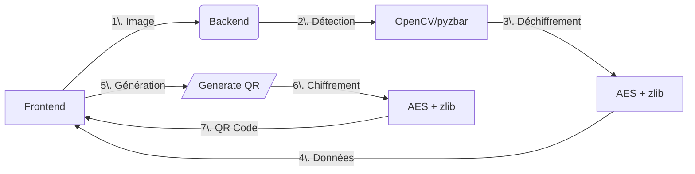

# Documentation Complète : Génération et Lecture de QR Codes

## I. Backend - Route /generate_prescription_qr

Objectif :
Génère un QR code chiffré contenant les informations de prescription médicale.

### I.1. Fonctionnement

1. Paramètres

    - doctor (obligatoire) : Objet contenant les informations du médecin
    - patient (obligatoire) : Objet contenant les informations du patient
    - date (obligatoire) : Date de la prescription (String)
    - content (obligatoire) : Contenu de la prescription (Array)

2. Processus

    ```py
    # 1. Validation des champs requis
    required_fields = ['doctor', 'patient', 'date', 'content']
    for field in required_fields:
        if field not in data:
            return jsonify({"error": f"Le champ '{field}' est requis"}), 400

    # 2. Génération du QR code avec chiffrement
    img_buffer = generate_rounded_qr_code(data, "prescription", True)

    # 3. Retour du fichier image
    return send_file(img_buffer, mimetype='image/png', 
                    as_attachment=True, download_name='prescription_qr.png')
    ```

3. Réponses

    - 200 OK : Fichier image du QR code généré
    - 400 Bad Request : Champs requis manquants
    - 500 Internal Error : Erreur de génération

### I.2. Sécurité

- Chiffrement AES-ECB des données
- Compression zlib pour réduire la taille
- Clé de chiffrement stockée dans .env
- QR code avec modules arrondis et couleur personnalisée

## II. Backend - Route /generate_direction_qr

### II.1. Objectif

Génère un QR code contenant les informations de direction vers une pharmacie.

### II.2. Fonctionnement

```py
# Paramètres requis
required_fields = ['pharmacy', 'transport', 'userCoords']

# Données optionnelles
- routeCoords: Coordonnées de l'itinéraire (Array, Optional)

# Génération du QR code
img_buffer = generate_rounded_qr_code(data, "direction", True)
```

### II.3. Structure des données

```json
{
    "pharmacy": {
        "name": "Nom de la pharmacie",
        "latitude": 48.8566,
        "longitude": 2.3522
    },
    "transport": "foot|car|bicycle",
    "userCoords": [48.8566, 2.3522],
    "routeCoords": [[48.8566, 2.3522], [48.8576, 2.3532]]
}
```

## III. Backend - Route /read_prescription_qr

### III.1. Objectif

Lit et déchiffre un QR Code contenant des informations de prescription.

### III.2. Fonctionnement

```py
# 1. Validation du fichier image
if 'image' not in request.files:
    return jsonify({"success": False, "error": "Aucun fichier image fourni"}), 400

# 2. Sauvegarde temporaire
with tempfile.NamedTemporaryFile(delete=False, suffix='.jpg') as temp_file:
    file.save(temp_file.name)
    temp_path = temp_file.name

# 3. Lecture et déchiffrement
success, result = read_qr_code(temp_path)

# 4. Nettoyage et retour
os.unlink(temp_path)
```

### III.3. Détection robuste

- Détection multi-échelle (0.5x à 3.0x)
- Amélioration d'image agressive (CLAHE, seuillage adaptatif, etc.)
- Correction de perspective automatique
- Rotation de l'image (0°, 90°, 180°, 270°)
- Support des QR codes inclinés ou déformés

## IV. Frontend - Composant StepOrdonnance

### IV.1. Workflow

1. Sélection du type de scan (QR ou ordonnance classique)
2. Ouverture de la caméra via ModalCamera
3. Capture et traitement de l'image
4. Appel API selon le type de scan

### IV.2. Gestion des QR codes

```js
// Vérification QR code
const checkQRCode = async (blob) => {
    const formData = new FormData();
    formData.append("image", blob, "photo.jpg");

    const response = await fetch(`${config.backendUrl}/read_prescription_qr`, {
        method: "POST",
        body: formData,
    });

    return await response.json();
};

// Traitement des données QR
if (qrData.success) {
    const medicaments = qrData.prescription?.content?.map((med, index) => ({
        id: index + 1,
        nom: med.split(' - ')[0] || `Médicament ${index + 1}`,
        posologie: med.split(' - ')[1] || med
    })) || [];

    updatePrescriptionData({
        medicaments: medicaments,
        scanType: 'qr',
        hasQRCode: true,
        rawData: qrData.prescription
    });
}
```

### IV.3. Navigation clavier

```js
// Gestion des touches
useEffect(() => {
    const handleKeyDown = (e) => {
        if (e.key === "ArrowRight") setSelectedIndex(prev => prev + 1);
        if (e.key === "ArrowLeft") setSelectedIndex(prev => prev - 1);
        if (e.key === "Enter") handleSelect(pharmaciesList[selectedIndex]);
    };
    document.addEventListener("keydown", handleKeyDown);
}, []);
```

## V. Frontend - Composant MapQrCodePage

### V.1. Génération QR direction

```js
const generateQRCode = async () => {
    try {
        const response = await fetch(`${config.backendUrl}/generate_direction_qr`, {
            method: 'POST',
            headers: { 'Content-Type': 'application/json' },
            body: JSON.stringify(qrData),
        });

        if (response.ok) {
            const blob = await response.blob();
            const url = URL.createObjectURL(blob);
            setQrCodeUrl(url);
        }
    } catch (err) {
        setError('Erreur réseau: ' + err.message);
    }
};
```

### V.2. Affichage du QR code

```js
{qrCodeUrl && (
    <div className="flex flex-col items-center space-y-4">
        
        <p className="text-sm text-gray-600 text-center">
            Scannez ce QR code pour obtenir l'itinéraire
        </p>
    </div>
)}
```

## VI. Scripts QR Code

### VI.1. Génération (qrCodeGen.py)

```py
def generate_rounded_qr_code(info, base_filename="prescription", return_buffer=False):
    # 1. Conversion en JSON
    json_content = json.dumps(info, ensure_ascii=False, separators=(',', ':'))

    # 2. Compression zlib
    compressed_data = zlib.compress(json_content.encode('utf-8'))

    # 3. Chiffrement AES
    encrypted_content = encrypt_data(compressed_data, secret_key)

    # 4. Génération QR code stylisé
    qr = qrcode.QRCode(
        version=None,
        error_correction=qrcode.constants.ERROR_CORRECT_Q,
        box_size=10,
        border=2,
    )
    
    # 5. Création image avec modules arrondis
    img = qr.make_image(
        image_factory=StyledPilImage,
        module_drawer=RoundedModuleDrawer(),
        color_mask=SolidFillColorMask(
            front_color=get_qr_color(),
            back_color=(255, 255, 255)
        ),
    )
```

### VI.2. Lecture (qrCodeLect.py)

```py
def detect_qr_codes_aggressively(image):
    # Détection multi-échelle
    scales = [0.5, 0.75, 1.0, 1.25, 1.5, 1.75, 2.0, 2.5, 3.0]
    
    for scale in scales:
        # Redimensionnement
        resized = cv2.resize(image, None, fx=scale, fy=scale)
        
        # Amélioration d'image
        enhanced_images = super_enhance_image(resized)
        
        # Détection avec OpenCV et pyzbar
        for enhanced_img in enhanced_images:
            # Détection OpenCV
            detector = cv2.QRCodeDetector()
            data_single, points, _ = detector.detectAndDecode(enhanced_img)
            
            # Détection pyzbar
            qr_codes = decode(enhanced_img, symbols=[ZBarSymbol.QRCODE])
```

## VII. Extrait de Code d'Exemple

### VII.1. Backend - Chiffrement

```py
def encrypt_data(data, key):
    cipher = AES.new(key, AES.MODE_ECB)
    if isinstance(data, str):
        data = data.encode('utf-8')
    padded_data = pad(data, AES.block_size)
    encrypted_data = cipher.encrypt(padded_data)
    return base64.b64encode(encrypted_data).decode('utf-8')
```

### VII.2. Frontend - Gestion d'état

```js
// Contexte de prescription
const updatePrescriptionData = (data) => {
    setPrescriptionData(prev => ({
        ...prev,
        ...data,
        timestamp: Date.now()
    }));
};

// Cache localStorage
const setPrescriptionCache = (data) => {
    localStorage.setItem('prescriptionCache',
        JSON.stringify({ data, timestamp: Date.now() })
    );
};
```

## VIII. Tips Essentiels

### VIII.1. Sécurité

- Clé de chiffrement de 32 octets minimum
- Stockage sécurisé des clés dans .env
- Validation stricte des données d'entrée
- Nettoyage automatique des fichiers temporaires

### VIII.2. Performance

- Compression zlib pour réduire la taille des QR codes
- Détection multi-échelle pour améliorer la reconnaissance
- Cache côté client pour les données fréquentes
- Timeout des requêtes (ex: 10s)

### VIII.3. UX Mobile

- Interface tactile optimisée
- Feedback visuel pendant le traitement
- Gestion des erreurs utilisateur-friendly
- Support des QR codes déformés ou inclinés

### VIII.4. Robustesse

```js
// Gestion d'erreurs complète
try {
    const qrData = await checkQRCode(blob);
    if (qrData.success) {
        // Traitement des données
    } else {
        setError("Aucun QR code valide détecté. Veuillez réessayer.");
    }
} catch (err) {
    setError("Erreur lors de la lecture du QR code: " + err.message);
}
```

## IX. Explications Globales

### IX.1. Architecture



### IX.2. Bonnes Pratiques

- Découplage : Front/Back indépendants
- Sécurité : Chiffrement systématique
- Robustesse : Détection multi-technique
- Performance : Compression et cache

### IX.3. Alternatives

- Remplacer AES par RSA pour la sécurité
- Utiliser Google Vision API pour la détection
- Implémenter un cache Redis côté serveur
- Ajouter une signature numérique

### IX.4. Points d'attention

- Limitations de taille des QR codes (2953 caractères max)
- Coût du chiffrement/déchiffrement
- Permissions caméra (navigateur)
- Qualité d'image pour la détection
