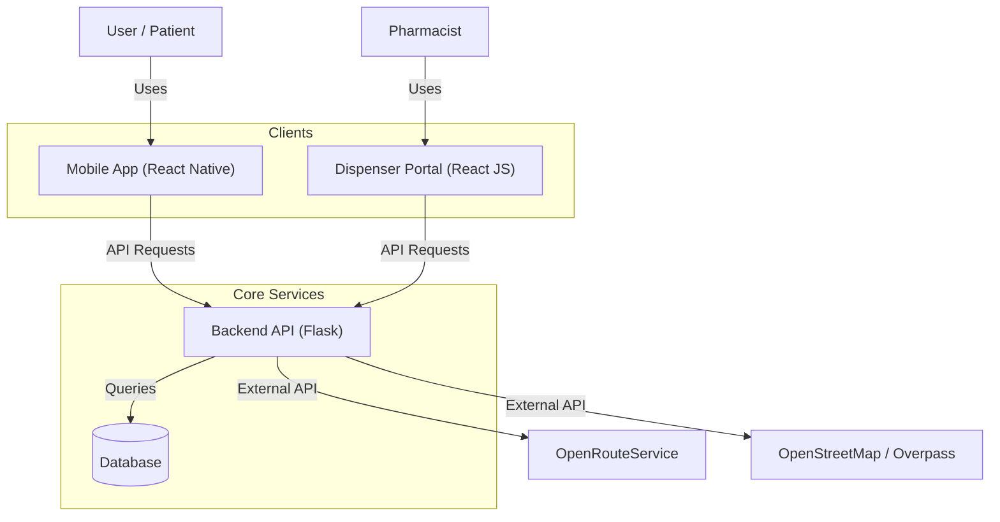

# System Architecture Overview

## Introduction
PharmaXcess is a comprehensive solution designed to facilitate access to pharmacies and medication. This document provides a high-level overview of the system architecture.

## High-Level Architecture

## Components

### 1. Mobile Application (React Native)
- **Purpose**: Primary interface for patients to find pharmacies, view routes, and manage prescriptions.
- **Key Features**:
    - Geolocation
    - QR Code scanning (Prescriptions)
    - Route display
    - Pharmacy search

### 2. Dispenser Portal (React JS)
- **Purpose**: Interface for pharmacists to manage inventory and view incoming orders/prescriptions.
- **Key Features**:
    - Dashboard
    - Inventory management
    - QR Code generation (if applicable)

### 3. Backend API (Flask)
- **Purpose**: Central server handling business logic, data storage, and external API integration.
- **Key Features**:
    - RESTful API endpoints
    - Dynamic CORS management
    - QR Code generation and encryption logic
    - Proxy for external geolocation services

### 4. External Services
- **OpenStreetMap (Overpass API)**: Used to find pharmacy locations based on coordinates.
- **OpenRouteService**: Used to calculate routes and directions between the user and the pharmacy.

## Data Flow
1.  **Pharmacy Search**: App sends coordinates -> Backend queries Overpass -> Backend returns sorted list.
2.  **Route Calculation**: App sends start/end points -> Backend queries ORS -> Backend returns geometry.
3.  **Prescription QR**: Backend generates encrypted QR -> App scans and decodes locally or verifies with Backend.

## Technology Stack
- **Frontend**: React Native (Mobile), React JS (Web)
- **Backend**: Python (Flask)
- **Database**: [Specify Database, e.g., PostgreSQL, SQLite, MongoDB]
- **Documentation**: Markdown, Mermaid diagrams
