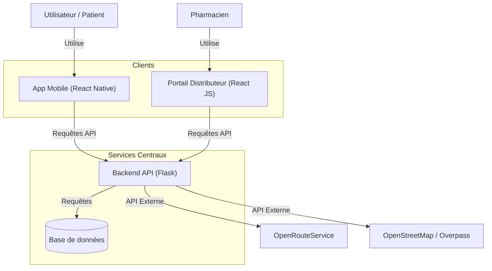

# Vue d'ensemble de l'architecture système

## Introduction
PharmaXcess est une solution complète conçue pour faciliter l'accès aux pharmacies et aux médicaments. Ce document fournit une vue d'ensemble de haut niveau de l'architecture du système.

## Architecture de haut niveau

## Composants

### 1. Application Mobile (React Native)
- **But** : Interface principale pour les patients afin de trouver des pharmacies, voir les itinéraires et gérer les ordonnances.
- **Fonctionnalités clés** :
    - Géolocalisation
    - Scan de QR Code (Ordonnances)
    - Affichage d'itinéraire
    - Recherche de pharmacie

### 2. Portail Distributeur (React JS)
- **But** : Interface pour les pharmaciens afin de gérer les stocks et voir les commandes/ordonnances entrantes.
- **Fonctionnalités clés** :
    - Tableau de bord
    - Gestion des stocks
    - Génération de QR Code (si applicable)

### 3. Backend API (Flask)
- **But** : Serveur central gérant la logique métier, le stockage des données et l'intégration des API externes.
- **Fonctionnalités clés** :
    - Endpoints API RESTful
    - Gestion dynamique des CORS
    - Logique de génération et chiffrement de QR Code
    - Proxy pour les services de géolocalisation externes

### 4. Services Externes
- **OpenStreetMap (Overpass API)** : Utilisé pour trouver les emplacements des pharmacies basés sur les coordonnées.
- **OpenRouteService** : Utilisé pour calculer les itinéraires et directions entre l'utilisateur et la pharmacie.

## Flux de données
1.  **Recherche de Pharmacie** : L'app envoie les coordonnées -> Le backend interroge Overpass -> Le backend retourne une liste triée.
2.  **Calcul d'itinéraire** : L'app envoie les points de départ/arrivée -> Le backend interroge ORS -> Le backend retourne la géométrie.
3.  **QR Ordonnance** : Le backend génère un QR chiffré -> L'app scanne et décode localement ou vérifie avec le backend.

## Stack Technologique
- **Frontend** : React Native (Mobile), React JS (Web)
- **Backend** : Python (Flask)
- **Base de données** : MySQL
- **Documentation** : Markdown, Diagrammes Mermaid
